Webo
====

Webo 是新浪微博第三方客户端

## UI 设计

* 初始界面

* 主界面

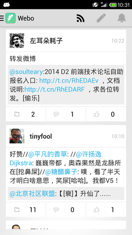

* 写微博

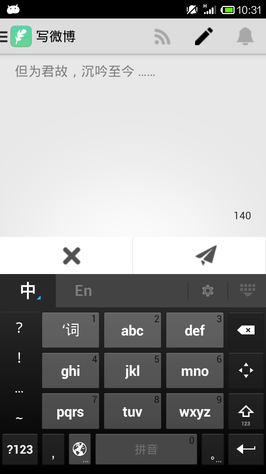

* 新消息

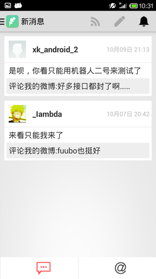

* 转发

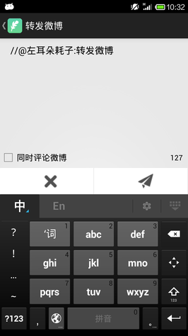

* 评论

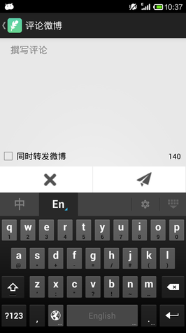

* 微博详情

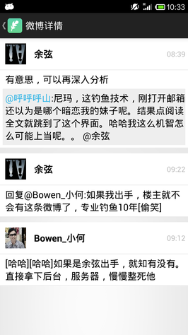

* 侧栏

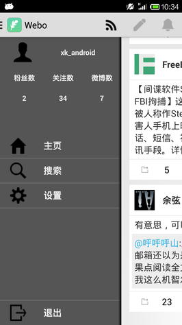

* 主页

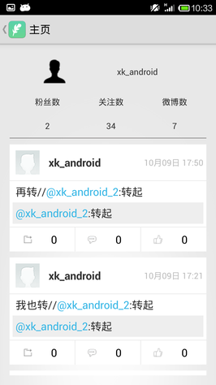

* 搜索

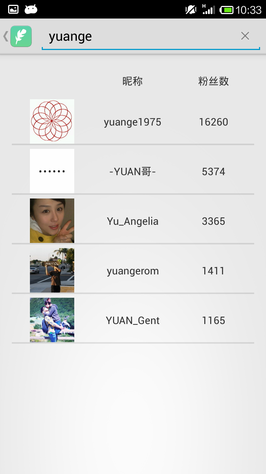

* 设置

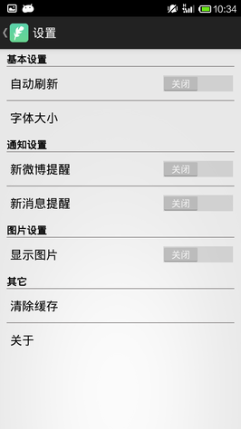

* 退出

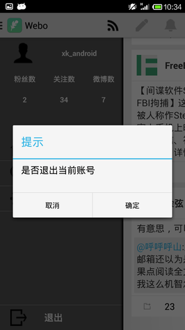

## 技术

* PullRefreshListView

* View Pager

* Menu Drawer

* 图片缓存

* 通知

这个 App 是国庆节期间写的，是我刚刚学习 android 的练习，每天的开发内容都有记录，在 doc 目录下。

## DONE

* 登录
* 下拉刷新微博
* 写微博
* 获取新消息提醒，包含新评论，有人at了我
* 评论
* 转发
* 查看自己的主页
* 搜索用户
* 退出

## TODO

* 设置仅完成了UI设计，功能还没有完成
* ~~刷新微博到底部时还没有完成加载更早的微博的功能，仅有下拉刷新最新微博~~
* 关注功能
* 消息自动提醒
* ~~按钮图标的设计不够精细~~
* 仅仅在小米上测试，其它机器没有完成适配
* 代码还需要重构，包括有代码可以复用的地方，功能的划分
* 资源文件还需要整理
* ~~加载效率，listivew 的效率还可以再提升~~
* 通过配置文件来设置参数
* 区分 Debug 版本和 Release 版本
